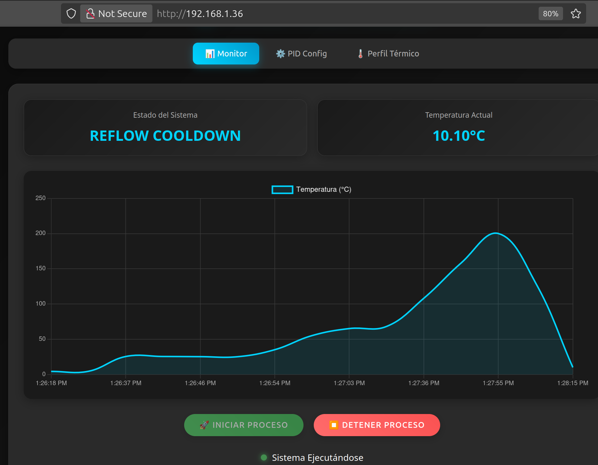

# 펌웨어 | Firmware 펌웨어

  

This directory contains all the firmware for the microcontrollers used in the **SMD Reflow Oven** project.

---

## 📂 Subdirectories

Here's a breakdown of what you'll find in each subfolder:

- ###  esp01/
  This folder holds the firmware for the **ESP-01S** module, which is responsible for hosting the web-based GUI. It includes the PlatformIO project and related tools for debugging and data analysis.

- ### nextionGUI/
  Contains the files for the **Nextion HMI** touchscreen display. This includes the `.HMI` file that defines the graphical user interface and custom fonts.

- ### stm32f411/
  This is where the main control firmware for the **STM32F411** microcontroller is located. This firmware manages the PID temperature control, thermal profiles, and all core functionalities of the oven. It also includes design files for a Kalman filter used for temperature sensing.

---

## 🚀 Getting Started

To work with the firmware in this directory, you will need:

- **PlatformIO** for the `esp01` and `stm32f411` projects.
- **Nextion Editor** for the `nextionGUI` files.
- **Python 3.x** for the utility scripts.

Each subdirectory contains a more detailed `README.md` file with specific instructions on how to use its contents.
