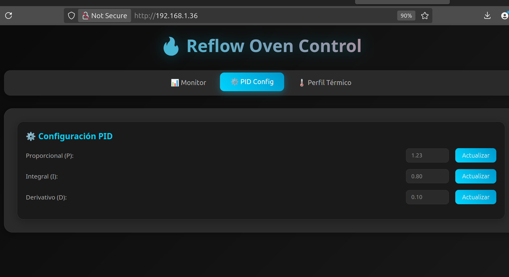

# 📶 ESP01 Firmware & Tools 📶

<p align="center">
  
</p>

Welcome to the **ESP01** section of the Reflow Oven Firmware project! This folder contains everything needed to enable wireless control, monitoring, and data analysis for your reflow oven using the ESP8266 microcontroller.

---

## 📂 Folder Structure

```
esp01/
├── esp01_webGUI/      # ESP8266 Web GUI firmware (PlatformIO project)
├── serial_debug/      # Python scripts for serial debugging and communication
└── web_scrap/         # Data analysis and web client scripts
```

---

## 🛠️ Components

### 1. **esp01_webGUI/**

- **Purpose:**  
  ESP8266 firmware for a web-based GUI to control and monitor the oven remotely.
- **Tech:**  
  PlatformIO, Arduino framework, HTML/CSS/JS for the web interface.
- **Features:**
  - 📡 Real-time temperature monitoring
  - 🎛️ Oven profile selection
  - 🕹️ Manual and automatic control modes
  - 🌐 WiFi configuration

### 2. **serial_debug/**

- **Purpose:**  
  Python utilities for serial communication and debugging.
- **Features:**
  - 📝 Log oven data
  - 📤 Send commands via USB serial
  - 🐛 Debug and test firmware responses

### 3. **web_scrap/**

- **Purpose:**  
  Scripts for data analysis, regression, and client-side logging.
- **Features:**
  - 📈 Analyze thermal profiles
  - 📄 Generate reports
  - 📊 Excel integration for advanced data visualization

---

## 🚀 Getting Started

1. **Web GUI Firmware**

   - Open `esp01_webGUI/` in PlatformIO.
   - Edit `configs.hpp` to set your WiFi credentials.
   - Build and upload to your ESP01 module.

2. **Serial Debugging**

   - Install Python 3 and required packages (`pip install pyserial`).
   - Run scripts in `serial_debug/` to communicate with the oven.

3. **Data Analysis**
   - Use scripts in `web_scrap/` for regression and thermal profile analysis.
   - Open Excel files for advanced data visualization.

---

## ✅ To-Do List

- [ ] Add OTA (Over-the-Air) firmware update support
- [ ] Improve mobile responsiveness of the web GUI
- [ ] Implement user authentication for web access
- [ ] Add MQTT integration for IoT platforms
- [ ] Enhance logging and error reporting in Python scripts
- [ ] Create example thermal profiles for testing

---

## 🤝 Contributing

Pull requests and suggestions are welcome! Please open an issue for bugs or feature requests.
