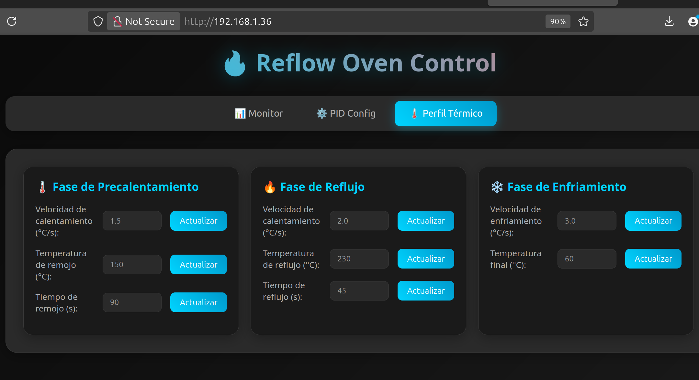

# 🖼️ Nextion GUI 🖼️

  

This folder contains the graphical user interface (GUI) project for the **Nextion HMI touchscreen display**.

---

## 📂 Contents

- **Reflow.HMI**: The main project file for the Nextion Editor.
- **fuentes/**: Custom fonts used in the GUI.
- **imagenes/**: Image assets for the interface.

---

## ✨ Features

- 🌡️ Real-time temperature display
- 📈 Oven profile selection
- 🔘 Manual and automatic control buttons
- ⚠️ Error and status notifications

---

## 🚀 Getting Started

1. **Open in Nextion Editor**: Open the `Reflow.HMI` file in the [Nextion Editor](https://nextion.tech/nextion-editor/).
2. **Customize**: Edit the screens, UI elements, and assets as needed.
3. **Compile & Upload**: Compile the project to generate a `.tft` file and upload it to your Nextion display.

---

## 📝 Note

The Nextion GUI was **not included in the final implementation** of the reflow oven. However, the files are available here if you wish to use a Nextion touchscreen display. Communication with the main MCU is done via UART, and designing the interface with the Nextion Editor is a fast and easy way to create a touch-enabled GUI.

For a demonstration of the Nextion GUI in action, watch this [YouTube video](https://youtube.com/shorts/_j2yINKcmlk?si=kRPrA2X6i5ZX8LdD).
