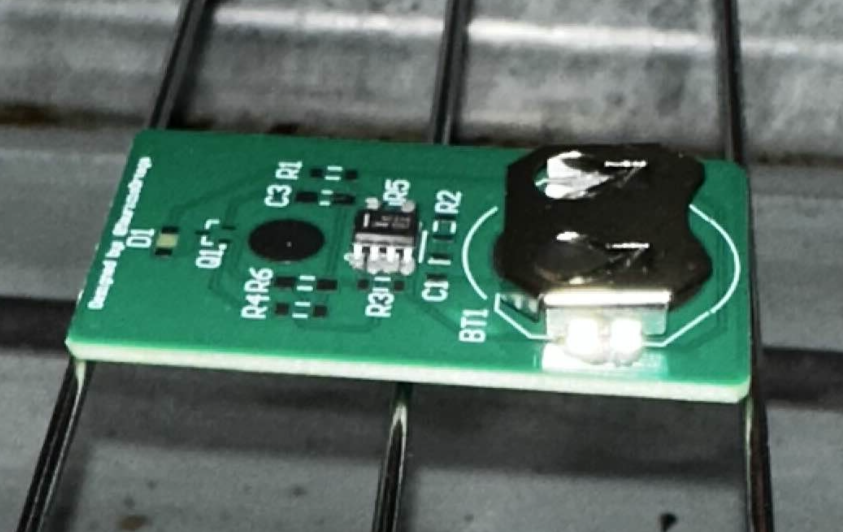

# 🧠 STM32F411 Firmware 🧠

<p align="center">
  
</p>

Welcome to the **STM32F411** section of the Reflow Oven Firmware project! This directory contains the core firmware that controls the reflow oven, running on an STM32F411 microcontroller.

---

## 📂 Folder Structure

```
stm32f411/
├── Kalman_filter_desing/   # MATLAB/Octave scripts for sensor filtering and analysis
└── reflow_oven/            # Main STM32 firmware (STM32CubeIDE project)
```

---

## 🛠️ Components

### 1. **Kalman_filter_desing/**

- **Purpose:**  
  Contains MATLAB/Octave scripts used to design and analyze a Kalman filter for reducing noise from the temperature sensors.
- **Usage:**  
  The filter coefficients generated from these scripts can be ported to the C firmware to improve temperature reading accuracy.

### 2. **reflow_oven/**

- **Purpose:**  
  The main STM32CubeIDE project for the reflow oven. This is the heart of the oven's control system.
- **Features:**
  - 🔥 **PID Control**: Precise temperature regulation using a PID controller.
  - 🔄 **State Machine**: Manages the different stages of the reflow process (preheat, soak, reflow, cooldown).
  - 🌡️ **Sensor Interface**: Reads data from thermocouple sensors (e.g., MAX6675).
  - 🖥️ **UI Backend**: Provides data to the user interface (web GUI or Nextion display).

---

## 🚀 Getting Started

1. **Open in STM32CubeIDE**: Open the `reflow_oven/` directory as a project in STM32CubeIDE.
2. **Configure Peripherals**: Use the `.ioc` file (STM32CubeMX) to view and modify the microcontroller's peripheral configurations.
3. **Build & Flash**: Build the project and flash the firmware to your STM32F411 board.
4. **Test & Debug**: Use a serial debugger to monitor the oven's status and troubleshoot any issues.

---

## ✅ To-Do List

- [ ] Refactor the state machine for better modularity.
- [ ] Implement EEPROM/Flash storage for user-defined reflow profiles.
- [ ] Add more advanced safety features (e.g., door open detection).
- [ ] Integrate a PID auto-tuning algorithm.
- [ ] Add unit tests for critical modules.

---

## 🤝 Contributing

Pull requests and suggestions are welcome! Please open an issue for bugs or feature requests.