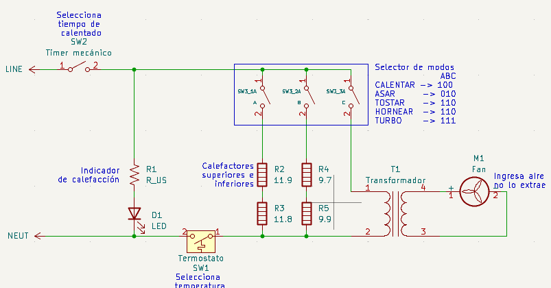

<!-- @format -->

# Reflow Oven Hardware

This directory contains all the design files, documentation, and resources needed to build and understand a custom reflow oven for PCB assembly. The repository is organized to facilitate hardware development, fabrication, and production processes using KiCad and related tools.

## Structure

- **horno_no_modificado/**: Contains the original, unmodified oven schematic files and backups.

  

- **horno_reflujo/**: Main folder for the reflow oven hardware, including:

  - KiCad project files (`.kicad_pcb`, `.kicad_sch`, `.kicad_pro`, etc.)
  - Symbol libraries and configuration files

- **imagenes/**: Reference images, schematics, and documentation PDFs

## Features

- Complete KiCad project for a reflow oven PCB
- Interactive BOM for easy component sourcing
- Production-ready files for PCB manufacturing and assembly
- Backup system to prevent data loss
- Visual documentation for hardware reference

## TODO

- [ ] Add detailed assembly instructions for the oven hardware
- [ ] Include safety guidelines and troubleshooting tips

---

## PCB – Improvements and Considerations

In the current version, the electronics perform their function correctly, with no relevant failures in the operation of the reflow oven. However, several possible improvements have been identified at the PCB level:

- **Space Optimization:** Migrate all THT (Through-Hole Technology) components to SMD (Surface-Mount Device) to reduce board size, facilitate routing, and allow higher component density.
- **Temperature Measurement Simplification:** Four thermocouples are currently used, but it was found that they do not provide a significant difference in system accuracy. Reducing to a single thermocouple would decrease pin usage and simplify circuit design.
- **Mounting Hole Issue:** The mounting holes are currently connected to the ground plane, which is not recommended. These should be isolated to avoid possible short circuits or mechanical interference when securing the PCB.
- **Inadequate External Connectors:** Smaller terminals than required were used for external connections, which can be risky when handling high currents. Using larger terminals that properly support the operating current is advised.
- **General Considerations:** Maintain good design practices such as separating power and signal traces, including ground planes, and arranging connectors for easy assembly and maintenance.

In conclusion, the proposed changes do not affect the main functionality of the system, but they optimize the PCB design in terms of space, simplicity, safety, and reliability.

---

## Case – Improvements and Considerations

The case for the PCB was designed in Autodesk Inventor to protect the electronics and allow safe mounting inside the reflow oven. The following improvements were identified during development:

- **Size Reduction:** By optimizing the PCB design (migrating to SMD components and reducing the number of thermocouples), the case could be made smaller, reducing material usage and improving system ergonomics.
- **Improved Closure:** The initial design used only screws for closure, which works but is not the most practical solution. Alternatives include snap-fit tabs or sliding guides with fewer screws to facilitate assembly and maintenance.
- **Accessibility:** Consider adding holes or slots for ventilation and access to external terminals and connectors, avoiding interference when handling cables and connections.

In conclusion, these improvements would result in a more compact, practical, and safe case, aligned with the PCB optimization.

---
