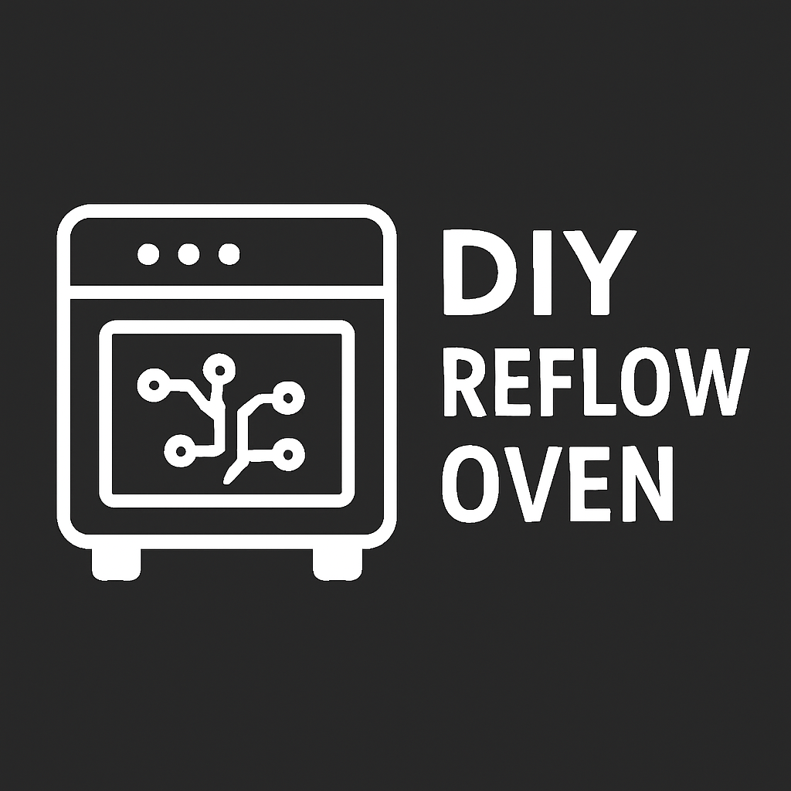
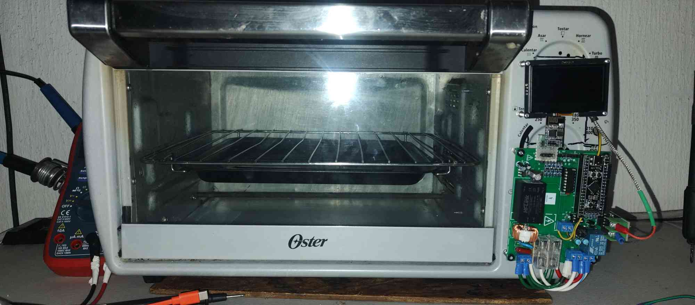

<!-- @format -->

Of course. Here is the improved, corrected, and reorganized version of your project's README file.

---

# 🔥 SMD Reflow Oven

\<p align="center"\>
\
\
\</p\>

\<p align="center"\>
\<b\>An open-source solution for SMD soldering with reflow technology.\</b\>\<br\>
\<i\>Modular, accessible, and designed for rapid prototyping and production.\</i\>
\</p\>

\<p align="center"\>
\
\
\
\
\
\</p\>

---

## 📑 Table of Contents

- [Overview](https://www.google.com/search?q=%23-overview)
- [Project Demo](https://www.google.com/search?q=%23-project-demo)
- [Workflow](https://www.google.com/search?q=%23-workflow)
- [Technical Challenges](https://www.google.com/search?q=%23-technical-challenges)
- [Repository Structure](https://www.google.com/search?q=%23-repository-structure)
- [Requirements & Dependencies](https://www.google.com/search?q=%23-requirements--dependencies)
- [Installation & Usage](https://www.google.com/search?q=%23%EF%B8%8F-installation--usage)
- [To-Do List](https://www.google.com/search?q=%23-to-do-list)
- [Possible Improvements](https://www.google.com/search?q=%23-possible-improvements)
- [Safety Considerations](https://www.google.com/search?q=%23%EF%B8%8F-safety-considerations)
- [Contributing](https://www.google.com/search?q=%23-contributing)
- [Reference Links](https://www.google.com/search?q=%23-reference-links)
- [Contributors](https://www.google.com/search?q=%23-contributors)
- [License](https://www.google.com/search?q=%23-license)

---

## 📝 Overview

The **SMD Reflow Oven** is an open-source project designed for precise SMD soldering. It utilizes configurable thermal profiles managed by an **STM32F411** microcontroller and a web-based GUI hosted on an **ESP01-S**. Key features include real-time PID temperature control, smart power management, and robust safety systems.

> ✅ **Functional Demo**: All core features (PID control, temperature sensing, web GUI, and the reflow algorithm) are fully operational and ready for soldering SMD components.
> 🚧 **Active Development**: Both the firmware and hardware are under continuous improvement.

---

## 📹 Project Demo

See the oven in action\! This video demonstrates its current functionality and soldering capabilities.

\<p align="center"\>
\<a href="[https://youtu.be/XSk6v5LdElc?si=d4BS0npnXu5F3Sj0](https://youtu.be/XSk6v5LdElc?si=d4BS0npnXu5F3Sj0)" target="\_blank"\>
\<b\>Watch a video demonstration of the oven in action\</b\>
\</a\>
\</p\>

---

## 🔄 Workflow

This section outlines the step-by-step process for soldering SMD components using the reflow oven.

\<details\>
\<summary\>\<b\>Click to expand the step-by-step SMD soldering process\</b\>\</summary\>

### 1\. 📋 PCB Preparation

- Apply solder paste evenly using a stencil.
- Carefully place the SMD components onto the pasted pads.

\<p align="center"\>
\
\</p\>

### 2\. ⚙️ Oven Setup

- Power the oven (120V AC).
- Select the appropriate thermal profile for your solder type via the web GUI.
- Verify that all safety systems are active.

### 3\. 🔥 Soldering Process

- Place the prepared PCB inside the oven chamber.
- Close the door securely and start the process from the interface.
- Monitor the temperature curve in real-time to ensure it follows the selected profile.

\<p align="center"\>
\
\</p\>

### 4\. 🔍 Final Inspection

- Wait for the **Cooldown** phase to complete before opening the door.
- Allow the PCB to cool completely before handling.
- Inspect the solder joints with a magnifier or microscope for any defects.
- Perform electrical tests to check for shorts or open circuits.

\<p align="center"\>
\<a href="[https://youtube.com/shorts/ztY0c23UdZQ?si=FxfqCBQ48sNtS6zn](https://youtube.com/shorts/ztY0c23UdZQ?si=FxfqCBQ48sNtS6zn)" target="\_blank"\>
📺 Watch the final results on YouTube
\</a\>
\</p\>
\</details\>

---

## 🎯 Technical Challenges

| Challenge                 | Solution Approach                                                                                                           |
| :------------------------ | :-------------------------------------------------------------------------------------------------------------------------- |
| **Temperature Control**   | Ensure uniform heat distribution, implement adaptable thermal curves, and design profiles to prevent component microcracks. |
| **Risk Management**       | Implement automatic overheating detection and shutoff, along with a system for filtering potentially toxic vapors.          |
| **Operational Precision** | Calibrate sensors accurately and synchronize heating/cooling stages for reliable and repeatable results.                    |

---

## 📂 Repository Structure

The **Serial Peripheral Interface (SPI)** is crucial in this project for fast communication between the STM32 microcontroller and peripherals like the **MAX6675 thermocouple sensors**, ensuring precise, real-time temperature readings for the PID control loop.

```
.
├── Firmware/
│   ├── esp01/
│   │   ├── esp01_webGUI/       # Web GUI source code for ESP01
│   │   └── serial_debug/       # Serial communication utilities
│   └── web_scrap/              # Python scripts for data analysis
├── Hardware/
│   ├── horno_no_modificado/    # Original oven hardware files
│   └── horno_reflujo/          # Reflow oven schematics, PCB, BOM
├── nextionGUI/                 # Touchscreen HMI files (if used)
├── stm32f411/                  # STM32F411 source code & Kalman filter design
├── imagenes/                   # Project images and diagrams
├── pictures/                   # Additional project photos
├── LICENSE                     # Project license
└── README.md                   # This guide
```

---

## 📦 Requirements & Dependencies

### Software

- **PlatformIO**: Recommended for firmware development.
- **Python 3.x**: For data analysis and utility scripts.
- **KiCad**: For viewing and editing hardware schematics and PCB layouts.
- **STM32CubeIDE**: Optional, for STM32-specific development.

### Hardware

- Refer to the **Bill of Materials (BOM)** located in the `Hardware/horno_reflujo/` directory for a complete list of components.

---

## 🛠️ Installation & Usage

1.  **Clone the Repository:**
    ```bash
    git clone https://github.com/La-guajolota/Horno_reflujo.git
    cd Horno_reflujo
    ```
2.  **Setup Firmware:**
    - Open the `Firmware/` and `stm32f411/` directories in PlatformIO.
    - Follow the specific setup instructions within each folder to compile and upload the firmware.
3.  **Assemble Hardware:**
    - Use the schematics and PCB files in the `Hardware/` directory as a guide.
    - Solder and assemble all components according to the BOM.
4.  **Calibrate & Test:**
    - Before the first use, perform temperature sensor calibration.
    - Test all safety systems to ensure they are functioning correctly.

---

## 📋 To-Do List

### High Priority

- [ ] Complete the documentation for hardware assembly.
- [ ] Implement a physical emergency stop button.
- [ ] Create a detailed guide for sensor calibration procedures.
- [ ] Add unit tests for critical firmware functions.

### Medium Priority

- [ ] Develop a mobile-friendly interface or a dedicated app.
- [ ] Add data logging and analysis features to track performance.
- [ ] Create 3D printable designs for the enclosure.
- [ ] Add multi-language support to the web GUI.

### Low Priority

- [ ] Integrate with PCB design software for profile suggestions.
- [ ] Add cloud connectivity for remote monitoring.
- [ ] Research machine learning for process optimization.

---

## 🚀 Possible Improvements

### Firmware Enhancements

- **Advanced PID Control**: Implement auto-tuning algorithms and adaptive control for even greater precision.
- **Enhanced Safety**: Add redundant sensors and fail-safe mechanisms.
- **Intuitive UI**: Improve the user interface with a touchscreen, OLED display, or rotary encoder.
- **IoT Integration**: Allow for remote monitoring and control over the internet.
- **Ventilation Control**: Develop an automated system to manage toxic vapor extraction.

### Hardware Upgrades

- **Improved Insulation**: Enhance thermal efficiency and user safety.
- **High-Accuracy Sensors**: Upgrade to more precise temperature sensors.
- **Modular Design**: Create a modular system to support different oven sizes.
- **Power Efficiency**: Optimize heating element control to reduce energy consumption.
- **Electrical Isolation**: Improve electrical isolation between high-voltage and low-voltage circuits.

---

## ⚠️ Safety Considerations

- ⚡ **High Voltage**: This project involves **120V AC**. Exercise extreme caution and ensure all connections are properly insulated.
- 🌡️ **High Temperatures**: The oven reaches temperatures capable of causing severe burns. Use protective equipment.
- 💨 **Ventilation**: Solder paste fumes can be toxic. Operate the oven in a well-ventilated area.
- 🔧 **Grounding**: Ensure the oven chassis is properly grounded to prevent electrical shock.
- 📏 **Calibration**: Regularly calibrate temperature sensors to maintain accuracy and prevent overheating.

---

## 🤝 Contributing

Contributions are welcome\! If you'd like to help improve this project, please follow these steps:

1.  **Fork the repository.**
2.  Create a new branch: `git checkout -b feature/your-amazing-feature`
3.  Make your changes and commit them: `git commit -m 'Add your amazing feature'`
4.  Push to your branch: `git push origin feature/your-amazing-feature`
5.  **Open a Pull Request** and describe the changes you've made.

Please report any bugs or suggest features by opening an issue on GitHub.

---

## 🔗 Reference Links

- [PlatformIO Documentation](https://docs.platformio.org/)
- [KiCad EDA Software](https://www.kicad.org/)
- [STM32 Documentation](https://www.st.com/en/microcontrollers-microprocessors/stm32-32-bit-arm-cortex-mcus.html)
- [Nextion HMI Displays](https://nextion.tech/)
- [SMD Soldering Guidelines](https://www.electronics-tutorials.ws/)
- [Reflow Soldering Profiles](https://www.smta.org/)

---

## 👥 Contributors

\<table\>
\<tr\>
\<td align="center"\>
\<a href="[https://github.com/La-guajolota](https://github.com/La-guajolota)"\>
\<b\>La-guajolota\</b\>\<br\>
\<sub\>Firmware Development\</sub\>
\</a\>
\</td\>
\<td align="center"\>
\<a href="[https://github.com/tonyg982](https://github.com/tonyg982)"\>
\<b\>tonyg982\</b\>\<br\>
\<sub\>Project Lead & Hardware Design\</sub\>
\</a\>
\</td\>
\</tr\>
\</table\>

---

## 📄 License

This project is licensed under the **MIT License**. See the [LICENSE](https://www.google.com/search?q=LICENSE) file for more details. This means you are free to use, modify, and distribute the project, provided you include the original copyright and license notice.

---

\<p align="center"\>
\<b\>Made with ❤️ by the Open Source Community\</b\>\<br\>
\<i\>If you find this project useful, please ⭐ star this repo\!\</i\>
\</p\>
