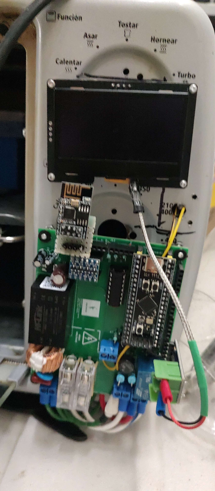
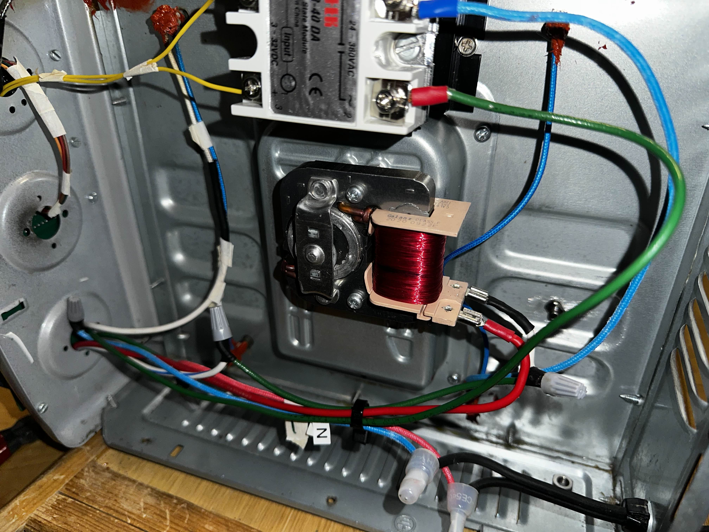

<!-- @format -->

# 🔥 SMD Reflow Oven

<p align="center">
  
  
</p>

<p align="center">
  <b>Open-source hardware & firmware for SMD soldering with reflow technology</b><br>
  Modular, accessible, and designed for rapid prototyping and production.
</p>

<p align="center">
  
  
  
  
  
  
  
</p>

---

## 📑 Table of Contents

1. [Overview](#overview)
2. [Workflow](#workflow)
3. [Technical Challenges](#technical-challenges)
4. [Repository Structure](#repository-structure)
5. [Requirements & Dependencies](#requirements--dependencies)
6. [Installation & Usage](#installation--usage)
7. [Images](#images)
8. [Reference Links](#reference-links)
9. [To-Do List](#to-do-list)
10. [Possible Improvements](#possible-improvements)
11. [Contributing](#contributing)
12. [Considerations](#considerations)
13. [Contributors](#contributors)
14. [License](#license)

---

## 📝 Overview

The SMD Reflow Oven project enables:

- **Precise SMD Soldering**: Using solder paste and configurable thermal profiles, managed by a STM32F411 and ESP01-S1 web GUI
- **Real-time Control**: Temperature curve control with PID feedback to prevent defects
- **Smart Power Management**: Random-crossover electronics power control for heating elements and On/Off fan for chamber temperature homogenization
- **Safety First**: Sensor malfunction detection, process monitoring, power supply fuse, and EMI filter

### Project Status

> ✅ **Functional Demo**: All core features (PID control, temperature sensing, web GUI, reflow algorithm) are working and ready for SMD component soldering.  
> 🚧 **Active Development**: Both firmware and hardware are under continuous improvement.

---

## 🔄 Workflow

<details>
<summary><b>Step-by-step SMD soldering process</b></summary>

### 1. 📋 PCB Preparation

- Apply solder paste using a stencil (can be 3D printed)
- Carefully place SMD components on the paste

### 2. ⚙️ Oven Setup

- Power the oven (120V AC)
- Select appropriate thermal profile according to solder type
- Configure PID gains via web GUI or source code
- Verify safety systems are active

### 3. 🔥 Soldering Process

- Insert prepared PCB into oven chamber
- Close oven door securely
- Press **Start Process** button
- Monitor temperature curve in real-time

### 4. 🔍 Final Inspection

- Wait for CoolDown state completion
- Open oven door completely for safety
- Allow adequate cooling time before handling
- Inspect solder joints with magnifier/microscope
- Perform electrical tests to detect shorts
- Manually correct any defective joints

</details>

---

## 🎯 Technical Challenges

| Challenge                 | Solution Approach                                                     |
| ------------------------- | --------------------------------------------------------------------- |
| **Temperature Control**   | Uniform distribution, adaptable thermal curves, microcrack prevention |
| **Risk Management**       | Automatic overheating detection, toxic vapor filtering                |
| **Operational Precision** | Sensor calibration, heating/cooling stage synchronization             |

---

## 📂 Repository Structure

```
.
├── Firmware/                    # Firmware for ESP01, STM32, serial debug
│   ├── esp01/                  # ESP01 microcontroller code
│   │   ├── esp01_webGUI/       # Web GUI for ESP01
│   │   └── serial_debug/       # Serial communication utilities
│   └── web_scrap/              # Python scripts for oven data analysis
├── nextionGUI/                 # Touchscreen HMI files and assets
├── stm32f411/                  # STM32F411 code and Kalman filter design
├── Hardware/                   # KiCad PCB and schematic files
│   ├── horno_no_modificado/    # Original oven hardware
│   └── horno_reflujo/          # Reflow oven hardware, BOM, backups
├── imagenes/                   # Images and diagrams
├── LICENSE                     # MIT License
└── README.md                   # Main project guide
```

---

## 📦 Requirements & Dependencies

### Software Requirements

- **PlatformIO** - Firmware development environment
- **Python 3.x** - Data analysis scripts
- **KiCad** - Hardware design and PCB layout
- **STM32CubeIDE** - STM32 development (optional)

### Hardware Requirements

- STM32F411 microcontroller
- ESP01-S1 WiFi module
- Temperature sensors (thermocouples)
- Heating elements and control circuitry
- Power supply (120V AC input)
- Safety components (fuses, EMI filters)

---

## 🛠️ Installation & Usage

### Quick Start

1. **Clone the repository:**

   ```bash
   git clone https://github.com/La-guajolota/Horno_reflujo.git
   cd Horno_reflujo
   ```

2. **Setup firmware environment:**

   - Install PlatformIO IDE or CLI
   - Navigate to firmware directories for specific setup instructions

3. **Hardware assembly:**

   - Follow hardware documentation in `Hardware/` directory
   - Refer to schematic files and BOM for component assembly

4. **Calibration:**
   - Perform temperature sensor calibration
   - Test safety systems before first use

---

## 🖼️ Images

<p align="center">
  <br>
  
</p>

---

## 📝 To-Do List

### High Priority

- [ ] Complete documentation for hardware assembly
- [ ] Add unit tests for critical firmware functions
- [ ] Implement emergency stop button functionality
- [ ] Create calibration procedures documentation
- [ ] Add thermal profile validation algorithms

### Medium Priority

- [ ] Develop mobile app interface
- [ ] Add data logging and analysis features
- [ ] Implement automatic thermal profile optimization
- [ ] Create 3D printable enclosure designs
- [ ] Add multi-language support for web GUI

### Low Priority

- [ ] Integration with PCB design software
- [ ] Cloud connectivity for remote monitoring
- [ ] Machine learning for process optimization
- [ ] Support for different oven sizes
- [ ] Advanced diagnostics and maintenance alerts

---

## 🚀 Possible Improvements

### 🔧 Firmware Enhancements

- **Advanced PID Control**: Auto-tuning algorithms and adaptive control
- **Enhanced Safety**: Redundant safety systems and fail-safe mechanisms
- **User Interface**: Intuitive touchscreen, OLED display, and rotary encoder input
- **Connectivity**: IoT integration for remote monitoring and control
- **Ventilation Control**: Automated toxic vapor management system

### 🔩 Hardware Upgrades

- **Improved Insulation**: Better thermal efficiency and safety
- **Enhanced Sensors**: Higher accuracy temperature measurement
- **Modular Design**: Support for different oven sizes and configurations
- **Power Efficiency**: Optimized heating element control
- **Safety Features**: Enhanced electrical isolation and emergency systems

---

## 🤝 Contributing

We welcome contributions from the community! Here's how you can help:

### How to Contribute

1. **Fork the repository**
2. **Create a feature branch**: `git checkout -b feature/amazing-feature`
3. **Make your changes**: Follow our coding standards
4. **Test thoroughly**: Ensure your changes don't break existing functionality
5. **Commit your changes**: `git commit -m 'Add amazing feature'`
6. **Push to the branch**: `git push origin feature/amazing-feature`
7. **Open a Pull Request**

### Areas Where We Need Help

- 📖 **Documentation**: Improve guides, add translations
- 🧪 **Testing**: Help test on different hardware configurations
- 🎨 **UI/UX**: Enhance web interface design and user experience
- 🔧 **Hardware**: PCB layout improvements and new features
- 🐛 **Bug Reports**: Found an issue? Please report it!
- 💡 **Feature Ideas**: Suggest new functionality

### Code Style Guidelines

- Use consistent indentation (4 spaces)
- Add comments for complex logic
- Follow existing naming conventions
- Include appropriate error handling
- Update documentation for new features

### Reporting Issues

Please use our GitHub Issues template and include:

- Detailed description of the problem
- Steps to reproduce
- Expected vs actual behavior
- Hardware/software versions
- Log files or error messages

---

## ⚠️ Considerations

### Safety Guidelines

- ⚡ **High Voltage Warning**: This project involves 120V AC - exercise extreme caution
- 🌡️ **Temperature Hazard**: Oven reaches high temperatures - use protective equipment
- 💨 **Ventilation Required**: Ensure proper ventilation when operating
- 🔧 **Electrical Safety**: Consider chassis earthing and logic ground isolation
- 📏 **Regular Calibration**: Maintain temperature sensor accuracy

### Best Practices

- Always use protective equipment when handling solder paste and PCBs
- Perform regular maintenance and calibration checks
- Keep emergency stop procedures readily accessible
- Follow local electrical safety codes and regulations

---

## 🔗 Reference Links

- [PlatformIO Documentation](https://docs.platformio.org/)
- [KiCad EDA](https://www.kicad.org/)
- [STM32 Documentation](https://www.st.com/en/microcontrollers-microprocessors/stm32-32-bit-arm-cortex-mcus.html)
- [Nextion HMI](https://nextion.tech/)
- [Python Serial](https://pyserial.readthedocs.io/en/latest/)
- [SMD Soldering Guidelines](https://www.electronics-tutorials.ws/)
- [Reflow Soldering Profiles](https://www.smta.org/)

---

## 👥 Contributors

<table>
  <tr>
    <td align="center">
      <a href="https://github.com/La-guajolota">
        <b>La-guajolota</b><br>
        <sub>Firmware Development</sub>
      </a>
    </td>
    <td align="center">
      <a href="https://github.com/tonyg982">
        <b>tonyg982</b><br>
        <sub>Project Lead & Hardware Design</sub>
      </a>
    </td>
  </tr>
</table>

### Want to become a contributor?

Check out our [Contributing Guide](#contributing) above and join our growing community!

---

## 📄 License

This project is licensed under the **MIT License**. See the [LICENSE](LICENSE) file for details.

### What this means:

- ✅ Commercial use allowed
- ✅ Modification allowed
- ✅ Distribution allowed
- ✅ Private use allowed
- ❗ License and copyright notice required

---

<p align="center">
  <b>Made with ❤️ by the Open Source Community</b><br>
  <i>Star ⭐ this repo if you find it useful!</i>
</p>

---

<p align="center">
  <sub>For questions or support, please open an issue or contact the maintainers.</sub>
</p>
